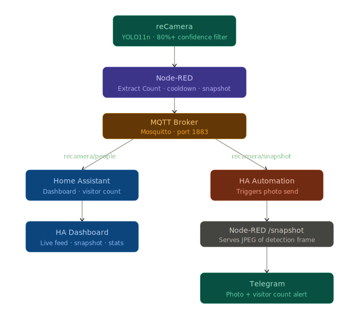
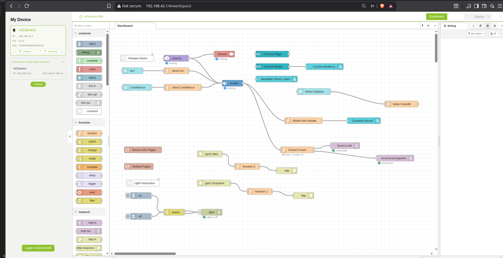
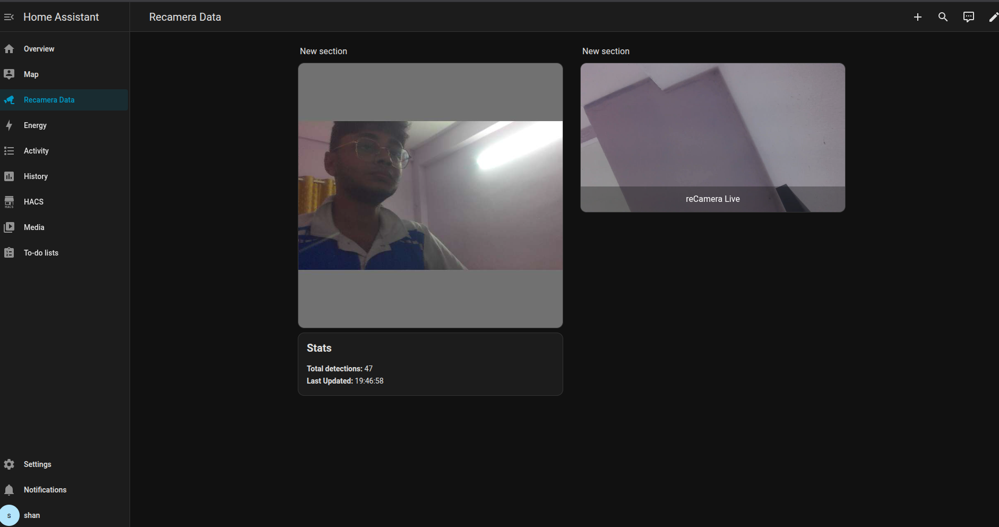

# reCamera AI Person Detection with Home Assistant & Telegram

This project uses the Seeed reCamera to detect people locally using YOLO11n, display live feeds and people detection captiures snapshots and poublishes it on on a Home Assistant dashboard, and send instant photo alerts to Telegram


##  Project Objectives

Based on the Ranger Training session, the core objectives were:

1. **Node-RED orchestration** — Wire detection results into real actions with zero cloud
2. **Home Assistant integration** — Link AI detection with the smart home ecosystem
3. **Telegram notifications** — Send real-time alerts with detection snapshots
4. **Camera live steam** — RTSP live stream on HA

### What We Did Additionally
Beyond the training objectives, we extended the project with:
- **Confidence filtering** — Only trigger alerts when detection confidence is ≥ 80%
- **Cooldown timer** — Prevent duplicate alerts with a 10 second cooldown between detections
- **HTTP snapshot endpoint** — Created a `/snapshot` endpoint in Node-RED to serve the exact detection frame as a JPEG and publishedit in HA as well as on Telegram
- **Visitor counting** — Track and display total unique visitor count


##  Hardware Used

- Recamera 2002W
- A PC/server running Ubuntu with Home Assistant in Docker
- Home WiFi router


##  Software & Tools

- **Node-RED** — Runs on the reCamera, handles all detection logic and routing
- **MQTT (Mosquitto)** — Lightweight messaging between reCamera and Home Assistant
- **Home Assistant** — Dashboard, automations, and smart home hub
- **Telegram Bot API** — Receives photo alerts on your phone


## System Architecture (thanks to claude for the flowchart)




##  Setup Guide

### 1. Hardware Setup

Connect the reCamera to your home WiFi network. Once connected, it will get an IP on your local network (e.g. `192.168.29.159`). It also creates a USB hotspot accessible at `192.168.42.1`.

Access Node-RED at:
```
http://192.168.42.1:1880
```
or via home WiFi:
```
http://<reCamera-IP>:1880
```

SSH access:
```bash
ssh recamera@192.168.42.1
# password: recamera (can be changed)
```

---

### 2. Node-RED Flow Setup

Import the `recamera_ha_flow.json` file into Node-RED:
- Go to Menu → Import → Select file → Choose `recamera_ha_flow.json`
- Click Import then Deploy

#### Key Nodes Explained:

**Extract Count (Core Logic Node)**

This is the heart of the system. It:
- Reads detection boxes from the YOLO model
- Filters by confidence ≥ 80% (box index 4)
- Implements a 10 second cooldown to prevent duplicate counts
- Saves the detection frame for the snapshot endpoint
- Publishes to MQTT topics

```javascript
let total = context.get('total_visitors') || 0;
let last_detection_time = context.get('last_detection_time') || 0;
let boxes = msg.payload.data.boxes;

let currently_detected = boxes && boxes.length > 0 && boxes.some(box => box[4] >= 80);
let now = Date.now();

if (currently_detected && (now - last_detection_time) > 10000) {
    total += 1;
    context.set('total_visitors', total);
    context.set('last_detection_time', now);
    
    flow.set('detection_image', msg.payload.data?.image || '');
    
    let imgMsg = {
        payload: 'detected',
        total: total
    };
    node.send([msg, imgMsg]);
} else {
    node.send([msg, null]);
}

global.set('latest_count', currently_detected ? 1 : 0);

node.status({fill: currently_detected ? 'green' : 'grey', shape: 'dot',
    text: 'now: ' + (currently_detected ? 1 : 0) + ' | total: ' + total});

msg.payload = String(total);
msg.topic = 'recamera/people';
return [msg, null];
```

**Key insight about the data structure:**
The YOLO model outputs boxes in this format:
```
[x1, y1, x2, y2, confidence, class]
```
Confidence is at index 4 and is a 0-100 value.

**Snapshot HTTP Endpoint**

Add `http in` → `function` → `http response` nodes:
- `http in`: Method GET, URL `/snapshot`
- Function node:

```javascript
let img = flow.get('detection_image') || '';
if (img) {
    let base64Data = img.replace(/^data:image\/\w+;base64,/, '');
    msg.payload = Buffer.from(base64Data, 'base64');
    msg.headers = { 'Content-Type': 'image/jpeg' };
} else {
    msg.payload = 'No image';
    msg.statusCode = 404;
}
return msg;
```

**Data Endpoint**

Add `http in` → `function` → `http response` nodes:
- `http in`: Method GET, URL `/data`
- Function node:

```javascript
msg.payload = {
    count: global.get('latest_count') || 0,
    image: global.get('latest_frame') || ''
};
msg.statusCode = 200;
return msg;
```

**MQTT Out Node (Send to HA)**
- Server: `<YOUR_HA_IP>`
- Port: `1883`
- Topic: Set dynamically from `msg.topic`

---
final node red flow will look like this

### Node-RED Flow


### 3. Home Assistant Setup

#### configuration.yaml

```yaml
input_number:
  recamera_people_count:
    name: "reCamera People Count"
    min: 0
    max: 100
    step: 1

input_text:
  recamera_people_raw:
    name: "reCamera RAW Count"
    max: 255
    initial: "0"

sensor:
  - platform: template
    sensors:
      recamera_mqtt_count:
        friendly_name: "People Detected"
        value_template: "{{ states('input_text.recamera_people_raw') }}"
        unit_of_measurement: "people"

camera:
  - platform: ffmpeg
    name: reCamera Live
    input: rtsp://admin:admin@<reCamera-IP>:554/live
```

#### automations.yaml

```yaml
- id: '1776174048516'
  alias: reCamera Person Count Update
  triggers:
  - topic: recamera/people
    trigger: mqtt
  actions:
  - target:
      entity_id: input_number.recamera_people_count
    data:
      value: '{{ trigger.payload | float(0) }}'
    action: input_number.set_value
  mode: single

- id: '1776243900001'
  alias: reCamera Snapshot to Telegram
  triggers:
  - topic: recamera/people
    trigger: mqtt
  conditions:
  - condition: template
    value_template: '{{ trigger.payload | int(0) > 0 }}'
  actions:
  - delay:
      seconds: 1
  - action: telegram_bot.send_photo
    data:
      caption: "📸 Person detected! Total visitors: {{ trigger.payload | int }}"
      chat_id: <YOUR_CHAT_ID>
      url: "http://<reCamera-IP>:1880/snapshot"
  - delay:
      minutes: 1
  mode: single
```

---

### 4. Telegram Bot Setup

1. Open Telegram → search `@BotFather`
2. Send `/newbot` → follow prompts → save your **API Token**
3. Search `@IDBot` → send `/getid` → save your **Chat ID**
4. In Home Assistant: Settings → Devices & Services → Add Integration → **Telegram Bot**
5. Choose **Polling** mode → paste API Token
6. Add your Chat ID to allowed list
   

### 5. MQTT Setup

Make sure Mosquitto MQTT broker is running on your HA server:
```bash
docker ps | grep mosquitto
```

The broker should be accessible at port `1883` on your local network.


### 6. HA Dashboard Setup

Add these cards to your dashboard:

**Detection Snapshot:**
```yaml
type: picture-entity
entity: camera.recamera_live
camera_view: live
name: reCamera Detection
show_state: false
```

**Stats:**
```yaml
type: markdown
content: >
  ## Stats
  **Total detections:** {{ states('input_number.recamera_people_count') | int }}
  **Last Updated:** {{ now().strftime('%H:%M:%S') }}
```

## Screenshots

### Home Assistant Dashboard


### Telegram Alert


##  Challenges faced

### Node-RED flows stopping and starting repeatedly

### Camera and model not restarting after reboot

**Solution:** Services need to be started in the correct order:
```bash
sudo /etc/init.d/S91sscma-node stop
sudo /etc/init.d/S03node-red stop
sudo /etc/init.d/S91sscma-node start
# wait 15 seconds
sudo /etc/init.d/S03node-red start
```
### MQTT connection dropping

### Duplicate person detection counts

**Solution:** Implemented a 10 second cooldown timer using `context.get('last_detection_time')`.

### reCamera WiFi hotspot instability
When accessing Node-RED via the USB hotspot (`192.168.42.1`), the connection drops frequently. More stable when accessed via home WiFi IP directly.

### Node-RED UI going black
Occasionally the Node-RED browser interface loses its WebSocket connection and all nodes appear black.


##  Results

- Person detection triggers within ~1 second of entering frame
- Only detections with ≥80% confidence are counted
- Telegram photo alert arrives within 2-3 seconds of detection
- 10 second cooldown prevents alert spam
- Live RTSP stream and detection snapshot on HA dashboard
- Total visitor count tracked and displayed
- Runs fully offline on local network


## Demo

> https://youtu.be/H_1WPvsQOgw

